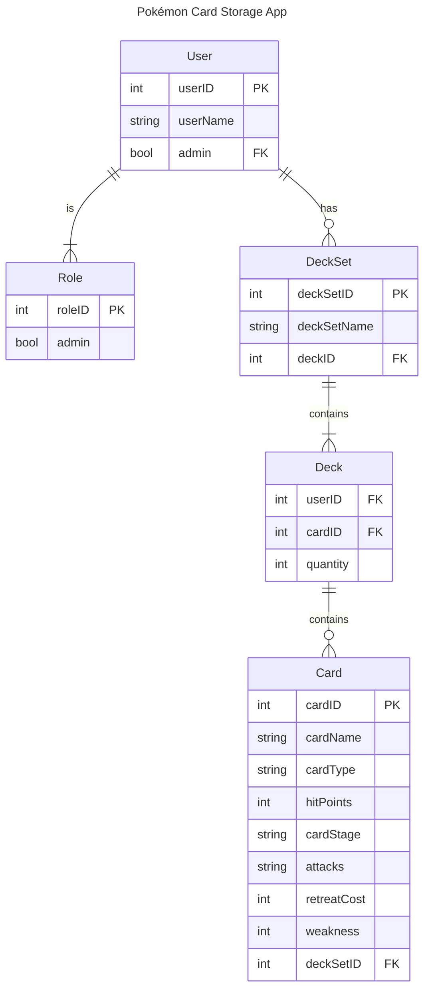

# Pokémon Card Storage Web App

#### Author:

> Mark McCorkle

## ER Diagram:

```mermaid

---
title: Pokémon Card Storage App
---

erDiagram
    
    Role {
        int roleID PK
        bool admin
    }
    
    User ||--o{ DeckSet : has
    User ||--|{ Role : is
    User {
        int userID PK
        string userName
        bool admin FK
    }
    
    DeckSet ||--|{ Deck : contains
    DeckSet {
        int deckSetID PK
        string deckSetName
        int deckID FK
    }
    
    Deck ||--o{ Card : contains
    Deck {
        int userID FK
        int cardID FK
        int quantity
    }
    
    Card {
        int cardID PK
        string cardName
        string cardType
        int hitPoints
        string cardStage
        string attacks
        int retreatCost
        int weakness
        int deckSetID FK
    }

```