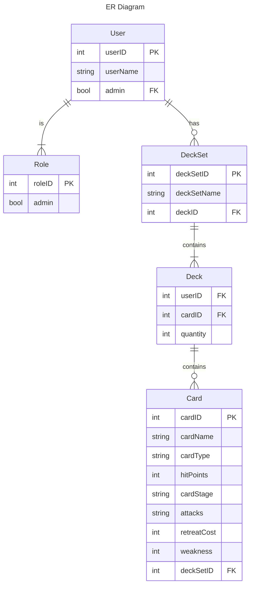
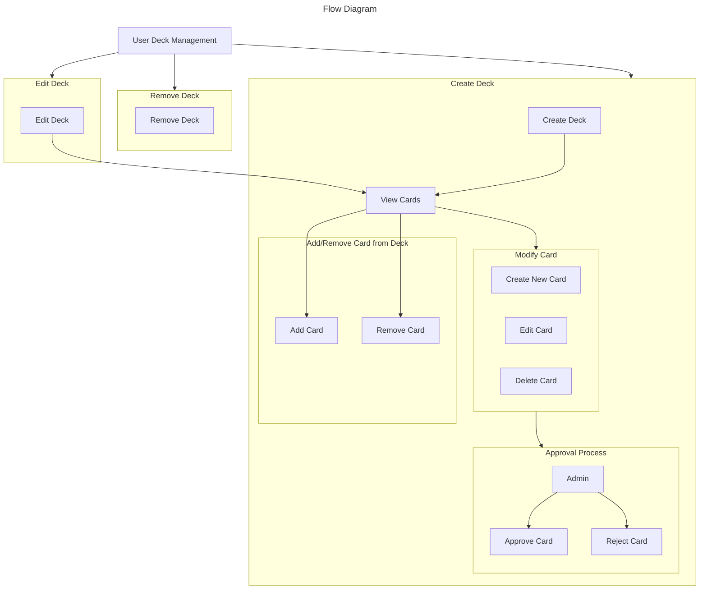

# Pokémon Card Storage Web App

#### Author:

> Mark McCorkle

## Diagrams:

```mermaid
---
title: ER Diagram
---
erDiagram
    
    Role {
        int roleID PK
        bool admin
    }
    
    User ||--o{ DeckSet : has
    User ||--|{ Role : is
    User {
        int userID PK
        string userName
        bool admin FK
    }
    
    DeckSet ||--|{ Deck : contains
    DeckSet {
        int deckSetID PK
        string deckSetName
        int deckID FK
    }
    
    Deck ||--o{ Card : contains
    Deck {
        int userID FK
        int cardID FK
        int quantity
    }
    
    Card {
        int cardID PK
        string cardName
        string cardType
        int hitPoints
        string cardStage
        string attacks
        int retreatCost
        int weakness
        int deckSetID FK
    }

```

## Flow Diagram:

```mermaid
---
title: Flow Diagram
---
flowchart TB
    user["User Deck Management"]
    createDecks["Create Deck"]
    viewCards["View Cards"]
    addCard["Add Card"]
    removeCard["Remove Card"]
    editDeck["Edit Deck"]
    removeDeck["Remove Deck"]
    newCard["Create New Card"]
    editCard["Edit Card"]
    deleteCard["Delete Card"]
    admin["Admin"]
    
    user --> CreateDeckGraph
    subgraph CreateDeckGraph["Create Deck"]
        createDecks --> viewCards
        viewCards --> addCard
        viewCards --> removeCard
        viewCards --> ModifyCardGraph
        subgraph addRemoveCard["Add/Remove Card from Deck"]
            addCard
            removeCard
        end
        removeCard
        subgraph ModifyCardGraph["Modify Card"]
            direction LR
            newCard
            editCard
            deleteCard
        end
        ModifyCardGraph --> ApproveCardGraph
    end

    user --> EditDeckGraph
    subgraph EditDeckGraph["Edit Deck"]
        editDeck --> viewCards
        subgraph addRemoveCard["Add/Remove Card"]
            addCard
            removeCard
        end
        removeCard    
    end
    
    user --> RemoveDeckGraph
    subgraph RemoveDeckGraph["Remove Deck"]
        removeDeck   
    end
    
    subgraph ApproveCardGraph["Approval Process"]
        direction TB
        admin --> approveCard["Approve Card"]
        admin --> rejectCard["Reject Card"]
    end
```